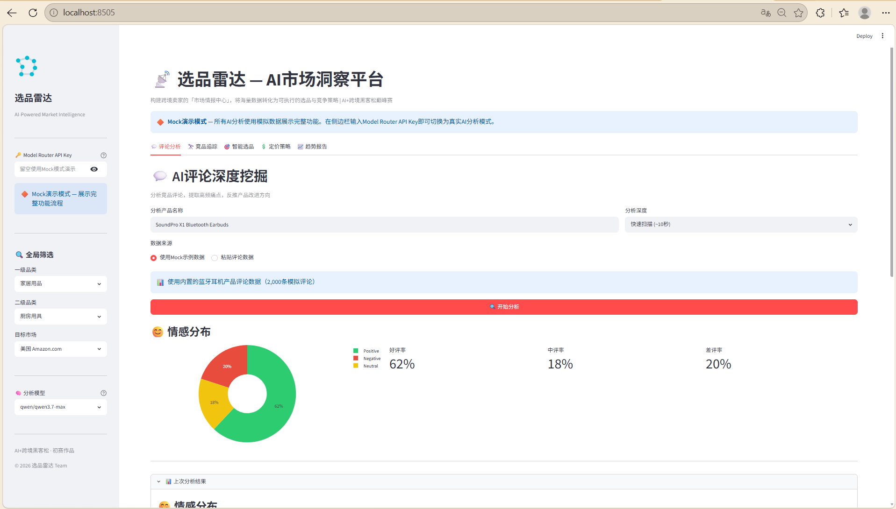
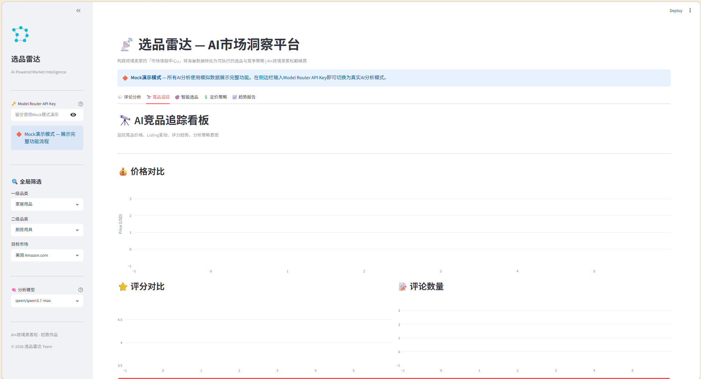
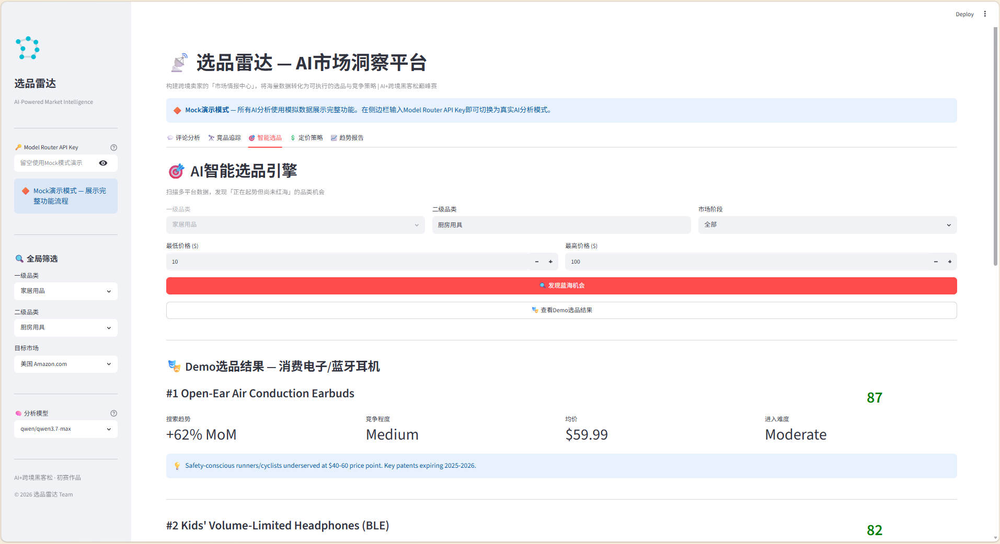
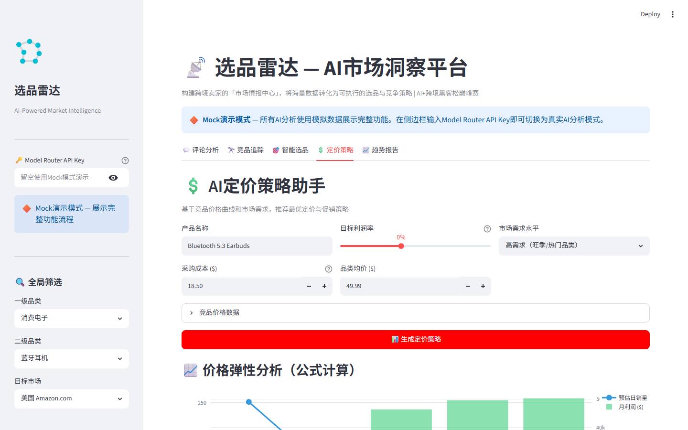
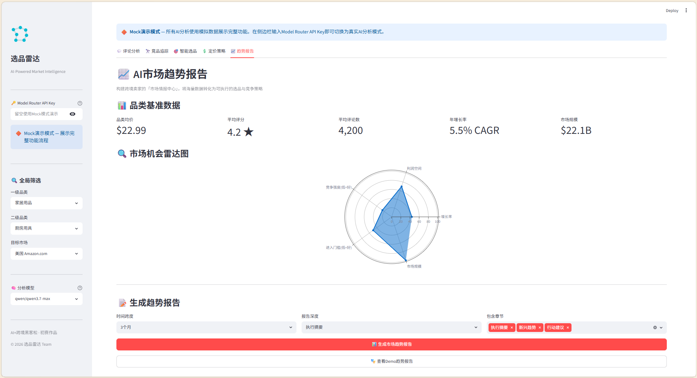

<p align="center">
  
</p>

<h1 align="center">选品雷达 — AI市场洞察平台</h1>
<p align="center">
  <b>构建跨境卖家的「市场情报中心」，将海量数据转化为可执行的选品与竞争策略</b>
</p>

<p align="center">
  
  
  
  
  
  
</p>

<p align="center">
  <b>AI+跨境黑客松巅峰赛 · 项目二</b> | 团队：SN0511 | 场景：AI 市场洞察
</p>

---

## 📖 项目简介

跨境卖家日常面临三大决策困境：

| 🤔 选什么品 | 👀 竞品在干嘛 | 💰 该卖多少钱 |
|------------|-------------|-------------|
| 凭经验拍脑袋，缺乏数据支撑 | 人工刷页面，效率低且易遗漏 | 定价靠感觉，卖不动或不赚钱 |

**选品雷达** 用 AI 将海量市场数据转化为可执行策略，让每位卖家都拥有自己的"市场情报团队"——用数据替代直觉做决策。

---

## ✨ 核心功能

<table>
<tr>
  <td width="50%">
    <h3>💬 评论深度挖掘</h3>
    <p>分析竞品评论情感分布、高频痛点排名、用户功能需求，反推产品改进方向</p>
    <p><sub>🤖 DeepSeek-R1 + Qwen 3.7 Max</sub></p>
  </td>
  <td width="50%">
    <h3>🔭 竞品追踪看板</h3>
    <p>实时监控竞品价格、评分、BSR排名、Listing变动，自动检测策略意图</p>
    <p><sub>🤖 Qwen 3.7 Max</sub></p>
  </td>
</tr>
<tr>
  <td>
    <h3>🎯 智能选品引擎</h3>
    <p>五维机会评分体系——搜索量趋势、竞争程度、价格空间、评论缺口、评分差距</p>
    <p><sub>🤖 DeepSeek-R1</sub></p>
  </td>
  <td>
    <h3>💲 定价策略助手</h3>
    <p>数值计算全走Python公式/算法，LLM仅做定性策略——杜绝浮点幻觉</p>
    <p><sub>🤖 DeepSeek-R1 + Python公式引擎</sub></p>
  </td>
</tr>
<tr>
  <td colspan="2" align="center">
    <h3>📈 市场趋势报告</h3>
    <p>品类趋势预测 · 消费者行为洞察 · 政策法规预警 · 战略行动建议</p>
    <p><sub>🤖 DeepSeek-R1</sub></p>
  </td>
</tr>
</table>

---

## 🏗️ 技术架构

```
┌─────────────────────────────────────────┐
│        Streamlit Dashboard (5 Tab)       │  ← 交互式可视化
│   评论分析 / 竞品追踪 / 选品 / 定价 / 趋势  │
├─────────────────────────────────────────┤
│        Modules (Pure Python)             │  ← 业务逻辑层
│    Review · Competitor · Select          │
│    Pricing · Trend                       │
├─────────────────────────────────────────┤
│        ModelRouter (Shared)              │  ← AI 调用层
│    OpenAI 兼容协议 · Mock/真实无缝切换    │
├─────────────────────────────────────────┤
│   Qwen3.5 Flash  →  Qwen3.7 Max  →  R1  │  ← 模型调度
│   (轻量分类)       (综合分析)     (深度推理) │
├─────────────────────────────────────────┤
│     阿里云百炼 Model Router API (126模型)  │  ← 算力平台
└─────────────────────────────────────────┘
```

**模型调度策略**：按任务复杂度智能匹配——轻量分类用 Qwen3.5 Flash（快），综合分析用 Qwen3.7 Max（稳），深度推理用 DeepSeek-R1（准）。

---

## 🚀 快速开始

```bash
# 1. 克隆仓库
git clone https://github.com/sunhao33/AI-CrossBorder-XuanPinLeiDa.git
cd AI-CrossBorder-XuanPinLeiDa

# 2. 安装依赖
pip install -r requirements.txt

# 3. 启动应用
cd project2_xuanpinleida
streamlit run app.py

# 4. 浏览器访问 http://localhost:8502
```

> 🔶 **Mock 演示模式**：无需 API Key 即可体验完整功能，内置蓝牙耳机品类完整 Demo 数据。输入 Model Router API Key 后自动切换为真实 AI 分析模式。

---

## 📁 项目结构

```
AI-CrossBorder-XuanPinLeiDa/
├── project2_xuanpinleida/
│   ├── app.py                          # Streamlit 主入口
│   ├── config.py                       # 品类/市场/分析深度配置
│   ├── modules/                        # 业务逻辑（纯Python，可复用）
│   │   ├── review_analyzer.py          # 评论深度分析
│   │   ├── competitor_tracker.py       # 竞品追踪管理
│   │   ├── product_selector.py         # 蓝海机会发现
│   │   ├── pricing_advisor.py          # 智能定价策略 ★含公式引擎
│   │   └── trend_reporter.py           # 市场趋势报告
│   ├── components/                     # UI组件（Streamlit渲染层）
│   │   ├── sidebar.py                  # 侧边栏 + 全局筛选
│   │   ├── review_tab.py               # 评论分析 Dashboard
│   │   ├── competitor_tab.py           # 竞品追踪看板
│   │   ├── selector_tab.py             # 智能选品页
│   │   ├── pricing_tab.py              # 定价策略页
│   │   └── trend_tab.py                # 趋势报告页
│   └── README.md
├── shared/                             # 共享模块
│   ├── model_router.py                 # Model Router API 统一客户端
│   └── mock_data.py                    # Mock 数据生成器（8品类覆盖）
├── requirements.txt
└── .gitignore
```

---

## 🛠️ 技术栈

| 层级 | 技术 | 用途 |
|------|------|------|
| 前端框架 | Streamlit | 5标签页 Dashboard + 侧边栏 |
| 可视化 | Plotly | 饼图/柱状图/折线图/雷达图/散点图 |
| 数据处理 | Pandas + NumPy | 弹性模拟/盈亏分析/竞争定位 |
| 词云 | Matplotlib + WordCloud | 评论关键词可视化 |
| AI 平台 | 阿里云百炼 Model Router | 126个模型一站式调用 |
| 推理模型 | DeepSeek-R1 | 深度市场分析/因果推断 |
| 文本模型 | Qwen 3.7 Max | 综合策略分析/文案生成 |
| 轻量模型 | Qwen 3.5 Flash | 快速分类/关键词提取 |
| 视觉模型 | Qwen3-VL Plus | 图片内容理解/合规检测 |
| 图片生成 | Wan2.7-Image-Pro | 商品图/广告素材生成 |
| 语言 | Python 3.11+ | 核心开发语言 |

---

## 🎯 方案亮点

- **多模型分工协作** — 按任务复杂度匹配模型：轻量→Flash / 综合→Qwen / 深度→R1
- **数值计算全走算法** — 定价弹性、盈亏分析、竞争定位由 Python 公式计算，LLM 仅做定性策略，杜绝浮点幻觉
- **Mock 数据演示** — 零依赖即可体验完整功能，API Key 一键切换真实 AI 模式
- **五维机会评分** — 智能选品从搜索趋势、竞争度、价格空间、评论缺口、评分差距五维度量化评估
- **模块化架构** — modules（业务逻辑）与 components（UI渲染）分离，业务代码独立可复用

---

## 📸 界面预览

<details>
<summary>点击展开查看5个功能标签页截图</summary>

|  |  |  |
|:---:|:---:|:---:|
| **💬 评论分析** | **🔭 竞品追踪** | **🎯 智能选品** |
|  |  |  |
| **💲 定价策略** | **📈 趋势报告** |
|  |  |

</details>

---

## 📋 比赛信息

| 项目 | 内容 |
|------|------|
| 赛事 | AI+跨境黑客松巅峰赛 |
| 命题场景 | 场景三：AI 市场洞察 |
| 初赛截止 | 2026年8月20日 |
| 主办方 | 菜鸟智谷 · 阿里云 · 跨境百人会 · 阿里国际AITIC |
| 算力平台 | 阿里云百炼 Model Router API |

---

<p align="center">
  <sub>Made with ❤️ by Team SN0511 · AI+跨境黑客松巅峰赛</sub>
</p>
